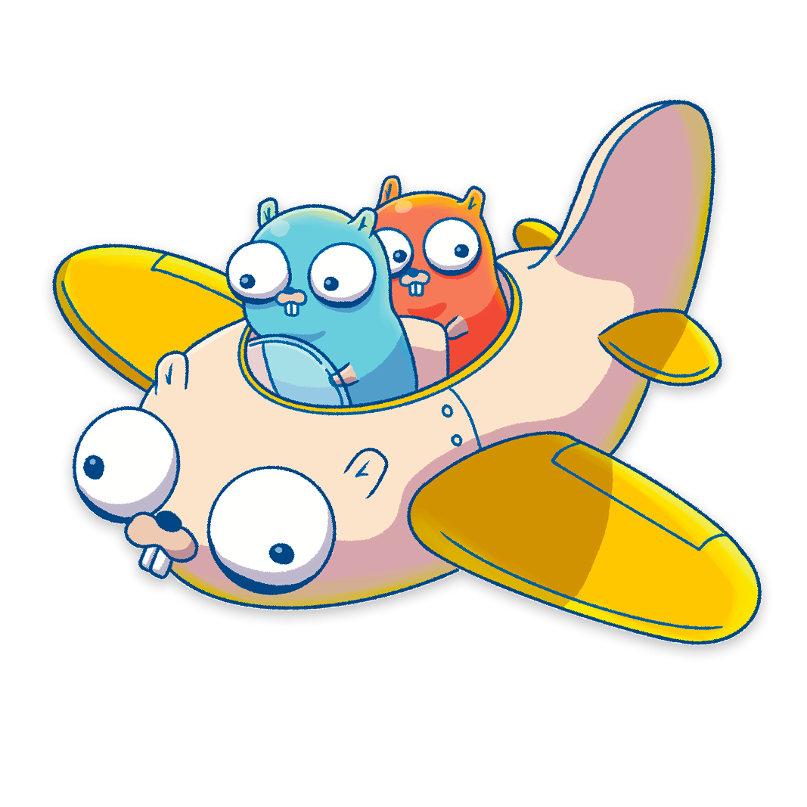

# claude-go-plugin

<p align="center">
  
</p>

A [Claude Code](https://claude.com/claude-code) plugin for Go development: an agent plus four modular skills covering idiomatic Go, CLI/DevOps tooling, microservices, and testing. Grounded in the [Google Go Style Guide](https://github.com/google/styleguide/tree/gh-pages/go), the [Uber Go Style Guide](https://github.com/uber-go/guide), the [Thanos coding style guide](https://github.com/thanos-io/thanos/blob/main/docs/contributing/coding-style-guide.md), and the [Kubernetes coding conventions](https://www.kubernetes.dev/docs/guide/coding-convention/).

## What's included

- **Agent** (`agents/go-senior-builder.md`): a senior Go builder that loads only the skills a request needs, then delivers a plan, patch-ready diffs, and verification steps.
- **Skills** (`skills/<name>/SKILL.md`), each a standalone playbook:
  - `go-patterns` — goroutines/channels, error handling (`errors.Is`/`errors.As`, wrapping conventions), interfaces, generics, context, package structure, naming.
  - `go-devops-tools` — CLI framework selection (Cobra / urfave/cli / stdlib flag), config management, logging, cloud SDKs, output formatting, `signal.NotifyContext` shutdown.
  - `go-microservices` — stdlib `net/http` routing (Go 1.22+), HTTP vs gRPC, handler and middleware patterns, observability, graceful shutdown, resilient service-to-service calls.
  - `go-testing-patterns` — table-driven tests, mocking, concurrency testing, `goleak`, `testing/synctest`, benchmarking, `go-cmp`, test helpers.
- **Hook** (`hooks/hooks.json` + `scripts/go-format.sh`): runs `gofmt -s` (and `goimports`, if installed) on a Go file immediately after Claude writes or edits it.

## Pairs with the Ginkgo plugin

`go-testing-patterns` covers standard-library, table-driven testing (the Google, Uber, and Thanos convention). For projects that use Ginkgo/Gomega, common in Kubernetes operators scaffolded with kubebuilder or controller-runtime, also install the official Ginkgo plugin, which ships dedicated skills maintained by Ginkgo's author:

```text
/plugin marketplace add onsi/ginkgo
/plugin install ginkgo@ginkgo
```

The two compose cleanly because skills are namespaced (`go:go-testing-patterns` vs `ginkgo:*`). This plugin defaults to stdlib testing and defers to the `ginkgo:*` skills when a project already commits to Ginkgo, rather than duplicating that framework's guidance.

## Install

Register this repo as a marketplace, then install the `go` plugin from it. Both steps work two ways.

### Inside Claude Code (slash commands)

Run these in the Claude Code prompt:

```text
/plugin marketplace add amaanx86/claude-go-plugin
/plugin install go@claude-go-plugin
```

### From the terminal (`claude plugin` CLI)

Run these in your shell (useful for scripting or provisioning a machine):

```bash
claude plugin marketplace add amaanx86/claude-go-plugin
claude plugin install go@claude-go-plugin
```

Either path resolves the plugin by its `name@marketplace` id (`go@claude-go-plugin`), where `go` is the plugin name and `claude-go-plugin` is the marketplace name from `.claude-plugin/marketplace.json`. Verify with `claude plugin list` (or `/plugin` in Claude Code).

To manage it later:

```bash
claude plugin update go@claude-go-plugin            # pull the latest version
claude plugin uninstall go@claude-go-plugin         # remove the plugin
claude plugin marketplace remove claude-go-plugin   # remove the marketplace (by name, not repo path)
```

For local development, point the marketplace at a directory checkout instead of the GitHub repo: `claude plugin marketplace add ./claude-go-plugin`.

## Requirements

- Go toolchain (`go`, `gofmt`) on `PATH` for the format hook and any verification steps the agent runs.
- `jq` on `PATH` (the hook script parses the tool-call JSON on stdin).
- `goimports` optional; the hook skips it silently if absent.

## License

Apache License 2.0 — see [LICENSE](LICENSE).
